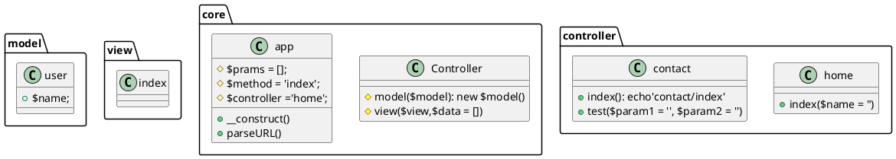

# Model-View-Controller

```plantuml

@startuml

package "model"  {
  class user{
      + $name;
  }
}


package "view"  {
  class index{

  }
}

package "core"  {
class Controller{
    # model($model): new $model()
    # view($view,$data = [])
}

class app{
   
    # $prams = [];
    # $method = 'index';
    # $controller ='home';
    + __construct()
    + parseURL()
}
}

package "controller"  {
class home{
    + index($name = ")
}  

class contact{
   + index(): echo'contact/index'
   + test($param1 = '', $param2 = '')
}
}


@enduml
```
