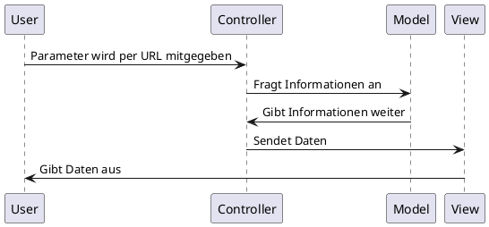

# Model-View-Controller

```plantuml

@startuml

User -> Controller: Parameter wird per URL mitgegeben
Controller -> Model: Fragt Informationen an
Model -> Controller: Gibt Informationen weiter
Controller -> View: Sendet Daten
View -> User: Gibt Daten aus


@enduml
```
