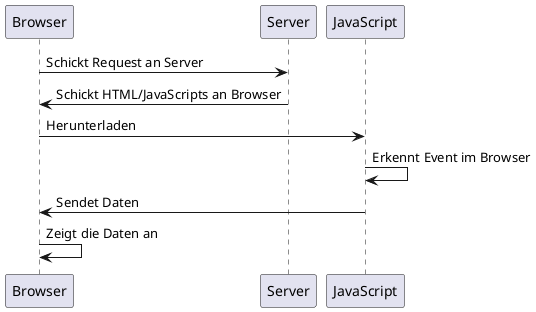

# Clientside Rendering Ablauf:

```plantuml
@startuml

Browser -> Server: Schickt Request an Server
Server -> Browser: Schickt HTML/JavaScripts an Browser
Browser -> JavaScript: Herunterladen
JavaScript -> JavaScript: Erkennt Event im Browser
JavaScript -> Browser: Sendet Daten
Browser -> Browser: Zeigt die Daten an


@enduml
```