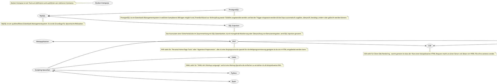

# Conceptmap

```plantuml
@startuml conceptmap
left to right direction

(Scripting-Sprachen) as (ScriptSprachen)
(PHP)
note bottom of (PHP)
    PHP steht für "Personal Home Page Tools" oder "Hypertext Preprocessor", dies ist eine Skriptsprache die speziell für die Webprogrammierung geeignet ist da sie in HTML eingebettet werden kann.
endnote
(Docker-Compose)
(YAML)
note bottom of (YAML)
    YAML steht für "YAML Ain't Markup Language" und ist eine Markup Sprache die einfacher zu verstehen ist als beispielsweise XML.
endnote
(ScriptSprachen) ---> (YAML)
(ScriptSprachen) ---> (PHP)
(Webapplikation) as (Web)
(SSR)
(CSR)
(Web) <--- (PHP)
(PHP) ---> (CSR)
(PHP) ---> (SSR)
(CSR) <---> (SSR)
note bottom of (CSR)
    CSR steht für Client Side Rendering,  womit gemeint ist dass der Host einen beispielsweise HTML-Request macht an einen Server und dieser ein HTML-File ohne weiteres sendet.
endnote
note bottom of (SSR)
    SSR steht für Server Side Rendering, wenn eine Website vorgerendert wird auf dem Server bezeichnet man dies als SSR. Der Server stellt eine statische HTML-Version der URL und des Clients bereit.
endnote
(Docker-Compose)
note left of (Docker-Compose)
    Docker-Compose ist ein Tool zum definieren und ausführen von mehreren Container.
endnote
(ScriptSprachen) <---> (Python)
(ScriptSprachen) <---> (Bash)
(MySQL)
note bottom of (MySQL)
    MySQL ist ein quellenoffenes Datenbank-Managementsystem. Es ist die Grundlage für dynamische Webseiten.
endnote
(MySQL) <---> (ProstgreSQL)
note bottom of (ProstgreSQL)
ProstgreSQL ist ein Datenbank-Managementsystem in welchem komplexere Abfragen möglich sind, Fremdschlüssel zur Verknüpfung zweier Tabellen angewendet werden und bei der Trigger eingesetzt werden die bei Input automatisch augelöst, überprüft, bestätigt, ändern oder gelöscht werden können.
endnote
(MySQL) <---> (SQL-Injection)
note bottom of (SQL-Injection)
Das Ausnutzen einer Sicherheitslücke im Zusammenhang mit SQL-Datenbanken, durch mangelnde Maskierung oder Überprüfung von Benutzereingaben, wird SQL-Injection genannt.
endnote

@enduml
```
