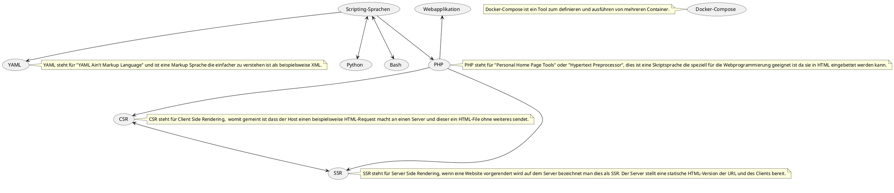

# Conceptmap

```plantuml
@startuml conceptmap

(Scripting-Sprachen) as (ScriptSprachen)
(PHP)
note right of (PHP)
    PHP steht für "Personal Home Page Tools" oder "Hypertext Preprocessor", dies ist eine Skriptsprache die speziell für die Webprogrammierung geeignet ist da sie in HTML eingebettet werden kann.
endnote
(Docker-Compose)
(YAML)
note right of (YAML)
    YAML steht für "YAML Ain't Markup Language" und ist eine Markup Sprache die einfacher zu verstehen ist als beispielsweise XML.
endnote
(ScriptSprachen) ---> (YAML)
(ScriptSprachen) ---> (PHP)
(Webapplikation) as (Web)
(SSR)
(CSR)
(Web) <--- (PHP)
(PHP) ---> (CSR)
(PHP) ---> (SSR)
(CSR) <---> (SSR)
note right of (CSR)
    CSR steht für Client Side Rendering,  womit gemeint ist dass der Host einen beispielsweise HTML-Request macht an einen Server und dieser ein HTML-File ohne weiteres sendet.
endnote
note right of (SSR)
    SSR steht für Server Side Rendering, wenn eine Website vorgerendert wird auf dem Server bezeichnet man dies als SSR. Der Server stellt eine statische HTML-Version der URL und des Clients bereit.
endnote
(Docker-Compose)
note left of (Docker-Compose)
    Docker-Compose ist ein Tool zum definieren und ausführen von mehreren Container.
endnote
(ScriptSprachen) <---> (Python)
(ScriptSprachen) <---> (Bash)

@enduml
```
